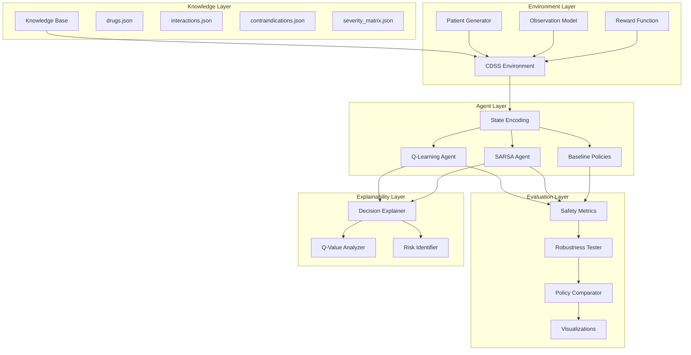
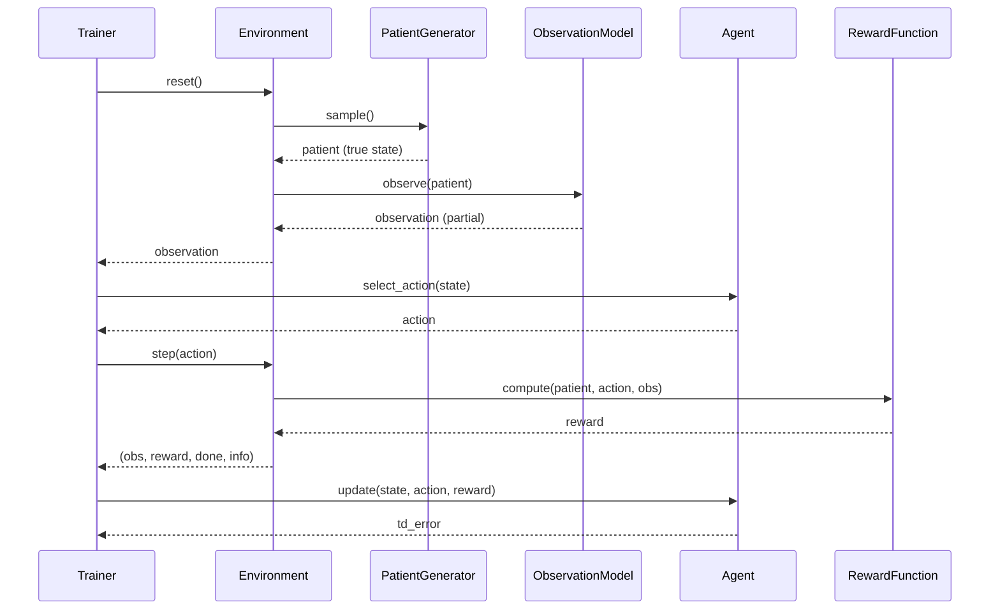
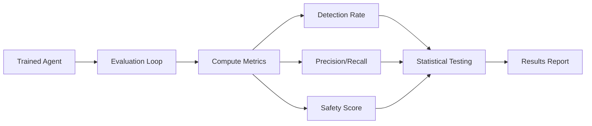

# System Architecture

## RL-Based Adaptive CDSS for Prescription Safety Under Uncertainty

**Author:** Herald Michain Samuel Theo Ginting  
**Repository:** <https://github.com/loxleyftsck/adaptive-cdss-under-uncertainty>

---

## 🏗️ ARCHITECTURE OVERVIEW

### High-Level System Design



---

## 📦 CORE COMPONENTS

### 1. Knowledge Base Module

**Purpose:** Store and manage pharmacological ground truth

**Components:**

```python
knowledge/
├── drugs.json              # Drug metadata (7 drugs)
├── interactions.json       # DDI pairs (12-15 interactions)
├── contraindications.json  # Drug-condition contraindications
└── severity_matrix.json    # Severity levels and penalties
```

**Class: KnowledgeBase**

```python
class KnowledgeBase:
    """
    Centralized repository for pharmacological knowledge.
    """
    def __init__(self, knowledge_path: str):
        self.drugs: Dict[str, DrugInfo]
        self.interactions: Dict[str, InteractionInfo]
        self.contraindications: Dict[str, List[str]]
        self.severity_matrix: Dict[str, SeverityInfo]
    
    def load_knowledge(self) -> None:
        """Load all JSON knowledge files"""
        
    def get_interaction(self, drug_a: str, drug_b: str) -> Optional[InteractionInfo]:
        """Retrieve interaction info for drug pair"""
        
    def get_contraindications(self, drug: str) -> List[str]:
        """Get list of contraindicated conditions"""
        
    def validate_consistency(self) -> bool:
        """Check for duplicate/conflicting entries"""
```

**Data Structures:**

```python
@dataclass
class DrugInfo:
    name: str
    drug_class: str
    common_uses: List[str]
    
@dataclass
class InteractionInfo:
    drug_pair: Tuple[str, str]
    severity: str  # "high", "medium", "low"
    mechanism: str
    evidence: str
    penalty: float

@dataclass
class SeverityInfo:
    level: str
    penalty: float
    description: str
```

---

### 2. Environment Module

**Purpose:** Simulate clinical decision-making environment with partial observability

#### 2.1 Patient Generator

**Class: PatientGenerator**

```python
class PatientGenerator:
    """
    Generate synthetic patient profiles with hidden states.
    """
    def __init__(self, drugs: List[str], conditions: List[str]):
        self.drugs = drugs
        self.conditions = conditions
        self.age_range = (18, 85)
    
    def sample(self) -> Patient:
        """
        Generate one synthetic patient.
        
        Returns:
            Patient with demographics, conditions, medications, hidden states
        """
        age = np.random.randint(*self.age_range)
        n_conditions = np.random.randint(0, 3)
        n_medications = np.random.randint(1, 4)
        
        patient = Patient(
            age=age,
            conditions=random.sample(self.conditions, n_conditions),
            medications=random.sample(self.drugs, n_medications),
            hidden_state=HiddenState(
                renal_function=self._sample_organ_function(impaired_prob=0.3),
                hepatic_function=self._sample_organ_function(impaired_prob=0.2)
            )
        )
        return patient
    
    def _sample_organ_function(self, impaired_prob: float) -> str:
        """Sample organ function status"""
        return np.random.choice(
            ["normal", "impaired"], 
            p=[1-impaired_prob, impaired_prob]
        )
```

**Data Structure:**

```python
@dataclass
class Patient:
    patient_id: str
    age: int
    conditions: List[str]
    medications: List[str]
    hidden_state: HiddenState

@dataclass
class HiddenState:
    renal_function: str  # "normal" | "impaired"
    hepatic_function: str  # "normal" | "impaired"
    metabolism_rate: str = "normal"  # Future extension
```

#### 2.2 Observation Model

**Class: ObservationModel**

```python
class ObservationModel:
    """
    Simulate EHR partial observability via data masking.
    """
    def __init__(self, missing_rate: float = 0.4):
        self.missing_rate = missing_rate
    
    def observe(self, patient: Patient) -> Observation:
        """
        Generate partial observation from true patient state.
        
        Args:
            patient: True patient state (hidden from agent)
        
        Returns:
            Observation with masked data
        """
        obs = Observation(
            age=patient.age,
            medications=patient.medications.copy()
        )
        
        # Stochastic masking of conditions
        if np.random.random() > self.missing_rate:
            obs.visible_conditions = patient.conditions.copy()
        else:
            obs.visible_conditions = []
        
        # Stochastic masking of lab results
        if np.random.random() > self.missing_rate:
            obs.lab_available = True
            obs.lab_results = patient.hidden_state
        else:
            obs.lab_available = False
            obs.lab_results = None
        
        # Compute data completeness indicator
        obs.data_completeness = self._compute_completeness(obs)
        
        return obs
    
    def _compute_completeness(self, obs: Observation) -> float:
        """Calculate data completeness score (0-1)"""
        completeness = 1.0
        if not obs.visible_conditions:
            completeness *= 0.6
        if not obs.lab_available:
            completeness *= 0.7
        return completeness
```

**Data Structure:**

```python
@dataclass
class Observation:
    age: int
    medications: List[str]
    visible_conditions: List[str] = field(default_factory=list)
    lab_available: bool = False
    lab_results: Optional[HiddenState] = None
    data_completeness: float = 1.0
```

#### 2.3 Reward Function

**Class: RewardFunction**

```python
class RewardFunction:
    """
    Safety-centered reward with alert fatigue penalty.
    """
    def __init__(self, knowledge_base: KnowledgeBase):
        self.kb = knowledge_base
    
    def compute(self, patient: Patient, action: int, 
                observation: Observation) -> float:
        """
        Compute reward based on true state and action.
        
        Args:
            patient: True patient state (for ground truth)
            action: Action taken (0=APPROVE, 1=WARN, 2=SUGGEST_ALT, 3=REQUEST_DATA)
            observation: Agent's observation (for context)
        
        Returns:
            Scalar reward
        """
        true_risk = self._compute_true_risk(patient)
        data_complete = observation.data_completeness
        
        if action == 0:  # APPROVE
            return self._reward_approve(true_risk)
        elif action == 1:  # WARN
            return self._reward_warn(true_risk)
        elif action == 2:  # SUGGEST_ALT
            return self._reward_suggest(true_risk)
        elif action == 3:  # REQUEST_DATA
            return self._reward_request_data(data_complete)
    
    def _compute_true_risk(self, patient: Patient) -> float:
        """Calculate ground truth risk score"""
        risk = 0.0
        
        # Check DDI risks
        for i, drug_a in enumerate(patient.medications):
            for drug_b in patient.medications[i+1:]:
                interaction = self.kb.get_interaction(drug_a, drug_b)
                if interaction:
                    risk += abs(interaction.penalty)
        
        # Check contraindications
        for drug in patient.medications:
            contra_conditions = self.kb.get_contraindications(drug)
            for condition in patient.conditions:
                if condition in contra_conditions:
                    risk += 8
            
            # Check hidden state contraindications
            if "renal_impairment" in contra_conditions:
                if patient.hidden_state.renal_function == "impaired":
                    risk += 8
        
        return min(risk, 20)  # Cap at 20
    
    def _reward_approve(self, risk: float) -> float:
        if risk == 0:
            return +2  # Safe approval
        elif risk < 5:
            return -2  # Missed minor risk
        elif risk < 10:
            return -5  # Missed moderate risk
        else:
            return -10  # MISSED SEVERE RISK (critical error)
    
    def _reward_warn(self, risk: float) -> float:
        if risk > 5:
            return +3  # Correct warning
        elif risk > 2:
            return +1  # Cautious (acceptable)
        else:
            return -1  # False alarm (alert fatigue)
    
    def _reward_suggest(self, risk: float) -> float:
        if risk > 8:
            return +4  # Excellent suggestion
        elif risk > 5:
            return +2  # Good suggestion
        else:
            return -1  # Unnecessary complexity
    
    def _reward_request_data(self, completeness: float) -> float:
        if completeness < 0.7:
            return (1 - completeness) * 2  # Up to +2 reward
        else:
            return -0.5  # Unnecessary delay
```

#### 2.4 CDSS Environment

**Class: CDSSEnvironment**

```python
class CDSSEnvironment:
    """
    Gym-like environment for prescription safety RL.
    Implements standard RL interface: reset(), step()
    """
    def __init__(self, knowledge_path: str = "knowledge/"):
        # Load components
        self.knowledge_base = KnowledgeBase(knowledge_path)
        self.patient_generator = PatientGenerator(
            drugs=list(self.knowledge_base.drugs.keys()),
            conditions=["diabetes", "hypertension", "renal_impairment", 
                       "heart_failure", "atrial_fibrillation"]
        )
        self.observation_model = ObservationModel(missing_rate=0.4)
        self.reward_function = RewardFunction(self.knowledge_base)
        
        # State tracking
        self.current_patient: Optional[Patient] = None
        self.action_space = 4  # APPROVE, WARN, SUGGEST_ALT, REQUEST_DATA
    
    def reset(self) -> Observation:
        """
        Start new episode with new patient.
        
        Returns:
            Initial observation
        """
        self.current_patient = self.patient_generator.sample()
        observation = self.observation_model.observe(self.current_patient)
        return observation
    
    def step(self, action: int) -> Tuple[None, float, bool, Dict]:
        """
        Execute action and return (obs, reward, done, info).
        
        Args:
            action: Action index (0-3)
        
        Returns:
            observation: None (episode ends after one decision)
            reward: Scalar reward
            done: Always True (episodic)
            info: Diagnostic information
        """
        assert self.current_patient is not None, "Must call reset() first"
        
        observation = self.observation_model.observe(self.current_patient)
        reward = self.reward_function.compute(
            self.current_patient, action, observation
        )
        
        info = {
            "true_risk": self.reward_function._compute_true_risk(self.current_patient),
            "action": action,
            "action_name": self._action_name(action),
            "patient_id": id(self.current_patient),
            "data_completeness": observation.data_completeness
        }
        
        done = True  # Episode ends after one decision
        
        return None, reward, done, info
    
    def _action_name(self, action: int) -> str:
        names = ["APPROVE", "WARN", "SUGGEST_ALT", "REQUEST_DATA"]
        return names[action]
```

---

### 3. Agent Module

#### 3.1 State Encoding

**Function: encode_state**

```python
def encode_state(observation: Observation) -> Tuple:
    """
    Convert observation to hashable state representation.
    Approximates belief state via feature aggregation.
    
    Args:
        observation: Partial patient observation
    
    Returns:
        Tuple representing discrete state
    """
    meds_tuple = tuple(sorted(observation.medications))
    age_bucket = observation.age // 10  # 10-year buckets
    completeness_level = int(observation.data_completeness * 10)
    conditions_tuple = tuple(sorted(observation.visible_conditions))
    
    state = (meds_tuple, age_bucket, completeness_level, conditions_tuple)
    return state
```

#### 3.2 Q-Learning Agent

**Class: QLearningAgent**

```python
class QLearningAgent:
    """
    Tabular Q-learning with epsilon-greedy exploration.
    Off-policy TD control.
    """
    def __init__(self, n_actions: int = 4, alpha: float = 0.1, 
                 gamma: float = 0.95, epsilon: float = 0.2):
        self.q_table: DefaultDict[Tuple, np.ndarray] = defaultdict(
            lambda: np.zeros(n_actions)
        )
        self.alpha = alpha      # Learning rate
        self.gamma = gamma      # Discount factor
        self.epsilon = epsilon  # Exploration rate
        self.n_actions = n_actions
    
    def select_action(self, state: Tuple) -> int:
        """Epsilon-greedy action selection"""
        if np.random.random() < self.epsilon:
            return np.random.randint(self.n_actions)  # Explore
        return int(np.argmax(self.q_table[state]))    # Exploit
    
    def update(self, state: Tuple, action: int, reward: float, 
               next_state: Optional[Tuple] = None, done: bool = True) -> float:
        """
        Q-learning update rule (off-policy).
        
        Returns:
            td_error: Temporal difference error (for logging)
        """
        if done:
            target = reward
        else:
            target = reward + self.gamma * np.max(self.q_table[next_state])
        
        td_error = target - self.q_table[state][action]
        self.q_table[state][action] += self.alpha * td_error
        
        return abs(td_error)
    
    def get_q_values(self, state: Tuple) -> np.ndarray:
        """Retrieve Q-values for state"""
        return self.q_table[state]
```

#### 3.3 SARSA Agent

**Class: SARSAAgent**

```python
class SARSAAgent(QLearningAgent):
    """
    On-policy SARSA algorithm.
    More conservative for safety-critical domains.
    """
    def update(self, state: Tuple, action: int, reward: float,
               next_state: Tuple, next_action: int, done: bool = True) -> float:
        """
        SARSA update rule (on-policy).
        Uses actual next action, not max.
        """
        if done:
            target = reward
        else:
            target = reward + self.gamma * self.q_table[next_state][next_action]
        
        td_error = target - self.q_table[state][action]
        self.q_table[state][action] += self.alpha * td_error
        
        return abs(td_error)
```

#### 3.4 Baseline Policies

**Class: RandomPolicy**

```python
class RandomPolicy:
    """Random action baseline (lower bound)"""
    def __init__(self, n_actions: int = 4):
        self.n_actions = n_actions
    
    def select_action(self, state: Any) -> int:
        return np.random.randint(self.n_actions)
```

**Class: RuleBasedCDSS**

```python
class RuleBasedCDSS:
    """
    Static rule-based baseline (current CDSS standard).
    """
    def __init__(self, knowledge_base: KnowledgeBase):
        self.kb = knowledge_base
    
    def select_action(self, observation: Observation) -> int:
        """
        Rule-based decision logic.
        Only considers visible information.
        """
        meds = observation.medications
        
        # Check for known high-severity interactions
        for i, drug_a in enumerate(meds):
            for drug_b in meds[i+1:]:
                interaction = self.kb.get_interaction(drug_a, drug_b)
                if interaction and interaction.severity == "high":
                    return 1  # WARN
        
        # Check for visible contraindications
        for condition in observation.visible_conditions:
            for drug in meds:
                if condition in self.kb.get_contraindications(drug):
                    return 2  # SUGGEST_ALT
        
        # Default to approve if no visible risks
        return 0  # APPROVE
```

**Class: PerfectOracle**

```python
class PerfectOracle:
    """
    Oracle with access to true patient state (upper bound).
    """
    def __init__(self, reward_function: RewardFunction):
        self.reward_fn = reward_function
    
    def select_action(self, patient: Patient) -> int:
        """
        Optimal decision with complete information.
        """
        true_risk = self.reward_fn._compute_true_risk(patient)
        
        if true_risk > 10:
            return 2  # SUGGEST_ALT
        elif true_risk > 5:
            return 1  # WARN
        else:
            return 0  # APPROVE
```

---

### 4. Training Module

**Class: Trainer**

```python
class Trainer:
    """
    Training loop with logging and checkpointing.
    """
    def __init__(self, env: CDSSEnvironment, agent: Union[QLearningAgent, SARSAAgent],
                 n_episodes: int = 500):
        self.env = env
        self.agent = agent
        self.n_episodes = n_episodes
        self.history = {
            "rewards": [],
            "td_errors": [],
            "episode": []
        }
    
    def train(self) -> Dict:
        """
        Main training loop.
        
        Returns:
            Training history
        """
        for episode in tqdm(range(self.n_episodes), desc="Training"):
            obs = self.env.reset()
            state = encode_state(obs)
            action = self.agent.select_action(state)
            
            _, reward, done, info = self.env.step(action)
            
            td_error = self.agent.update(state, action, reward)
            
            # Logging
            self.history["rewards"].append(reward)
            self.history["td_errors"].append(td_error)
            self.history["episode"].append(episode)
            
            # Periodic progress logging
            if (episode + 1) % 100 == 0:
                self._log_progress(episode)
        
        return self.history
    
    def _log_progress(self, episode: int):
        """Print training progress"""
        recent_rewards = self.history["rewards"][-100:]
        avg_reward = np.mean(recent_rewards)
        avg_td = np.mean(self.history["td_errors"][-100:])
        print(f"Episode {episode+1}: Avg Reward={avg_reward:.2f}, Avg TD Error={avg_td:.3f}")
```

---

### 5. Evaluation Module

**Class: SafetyMetrics**

```python
class SafetyMetrics:
    """
    Compute safety-specific evaluation metrics.
    """
    def __init__(self, env: CDSSEnvironment, agent: Any, n_episodes: int = 100):
        self.env = env
        self.agent = agent
        self.n_episodes = n_episodes
    
    def evaluate(self) -> Tuple[Dict, Dict]:
        """
        Run evaluation episodes and compute metrics.
        
        Returns:
            metrics: Aggregated performance metrics
            raw_results: Episode-level results
        """
        results = {
            "severe_detected": 0,
            "severe_missed": 0,
            "false_warnings": 0,
            "safe_approvals": 0,
            "total_episodes": 0
        }
        
        for _ in range(self.n_episodes):
            obs = self.env.reset()
            state = encode_state(obs)
            action = self.agent.select_action(state)
            
            _, reward, done, info = self.env.step(action)
            
            true_risk = info["true_risk"]
            
            # Classify outcome
            if true_risk > 8:  # Severe risk present
                if action in [1, 2]:  # WARN or SUGGEST_ALT
                    results["severe_detected"] += 1
                else:
                    results["severe_missed"] += 1
            else:  # No severe risk
                if action in [1, 2]:
                    results["false_warnings"] += 1
                elif action == 0:
                    results["safe_approvals"] += 1
            
            results["total_episodes"] += 1
        
        # Compute rates
        metrics = {
            "detection_rate": results["severe_detected"] / 
                             (results["severe_detected"] + results["severe_missed"] + 1e-6),
            "false_negative_rate": results["severe_missed"] / 
                                   (results["severe_detected"] + results["severe_missed"] + 1e-6),
            "precision": results["severe_detected"] / 
                        (results["severe_detected"] + results["false_warnings"] + 1e-6),
            "false_alarm_rate": results["false_warnings"] / results["total_episodes"],
            "safety_score": 0.5 * (
                results["severe_detected"] / (results["severe_detected"] + results["severe_missed"] + 1e-6) -
                results["severe_missed"] / (results["severe_detected"] + results["severe_missed"] + 1e-6)
            )
        }
        
        return metrics, results
```

---

## 🔄 DATA FLOW ARCHITECTURE

### Training Pipeline



### Evaluation Pipeline



---

## 📁 FILE STRUCTURE

```
adaptive-cdss-under-uncertainty/
├── knowledge/                    # Knowledge base
│   ├── drugs.json
│   ├── interactions.json
│   ├── contraindications.json
│   └── severity_matrix.json
│
├── env/                          # Environment module
│   ├── __init__.py
│   ├── patient_generator.py
│   ├── observation_model.py
│   ├── reward.py
│   └── cdss_env.py              # Main environment class
│
├── agent/                        # Agent module
│   ├── __init__.py
│   ├── state_encoding.py
│   ├── q_learning.py
│   ├── sarsa.py
│   ├── baselines.py             # Random, Rule-Based, Oracle
│   └── trainer.py
│
├── evaluation/                   # Evaluation module
│   ├── __init__.py
│   ├── metrics.py               # SafetyMetrics class
│   ├── robustness.py            # Robustness testing
│   ├── comparison.py            # Baseline comparison
│   └── visualize.py             # Plotting functions
│
├── explainability/               # Explainability module
│   ├── __init__.py
│   ├── explainer.py             # Decision explanation
│   └── q_analyzer.py            # Q-value analysis
│
├── notebooks/                    # Jupyter notebooks
│   ├── 01_exploration.ipynb
│   ├── 02_training.ipynb
│   └── 03_evaluation.ipynb
│
├── tests/                        # Unit tests
│   ├── test_environment.py
│   ├── test_agents.py
│   └── test_metrics.py
│
├── results/                      # Experiment results
│   ├── plots/
│   ├── metrics/
│   └── models/
│
├── docs/                         # Documentation
│   ├── formulation.md
│   ├── architecture.md          # This file
│   └── references.md
│
├── main.py                       # Main execution script
├── config.yaml                   # Configuration
├── requirements.txt
└── README.md
```

---

## 🔧 TECHNOLOGY STACK

### Core Dependencies

| Component | Library | Version | Purpose |
|-----------|---------|---------|---------|
| **Numerical Computing** | NumPy | ≥1.21 | Array operations, random sampling |
| **Data Manipulation** | Pandas | ≥1.3 | Metrics aggregation, results storage |
| **Visualization** | Matplotlib | ≥3.4 | Learning curves, robustness plots |
| **Progress Tracking** | tqdm | ≥4.62 | Training loop progress bars |
| **Statistical Testing** | SciPy | ≥1.7 | Hypothesis testing, confidence intervals |
| **Fuzzy Logic (Optional)** | scikit-fuzzy | ≥0.4 | Fuzzy reward function |

### Development Tools

- **Type Checking:** mypy
- **Testing:** pytest
- **Code Formatting:** black
- **Linting:** flake8, pylint
- **Documentation:** Sphinx (optional)

---

## ⚙️ CONFIGURATION MANAGEMENT

**config.yaml:**

```yaml
environment:
  missing_rate: 0.4
  drugs:
    - warfarin
    - aspirin
    - ibuprofen
    - metformin
    - lisinopril
    - atorvastatin
    - amlodipine
  conditions:
    - diabetes
    - hypertension
    - renal_impairment
    - heart_failure
    - atrial_fibrillation

agent:
  algorithm: "q_learning"  # or "sarsa"
  alpha: 0.1
  gamma: 0.95
  epsilon: 0.2

training:
  n_episodes: 500
  log_interval: 100
  save_interval: 100

evaluation:
  n_test_episodes: 100
  missing_rates: [0.2, 0.4, 0.6, 0.8]
  n_runs: 5  # For statistical validation

paths:
  knowledge: "knowledge/"
  results: "results/"
  models: "results/models/"
```

---

## 🚀 EXECUTION FLOW

### Main Script (main.py)

```python
import yaml
from env.cdss_env import CDSSEnvironment
from agent.q_learning import QLearningAgent
from agent.trainer import Trainer
from evaluation.metrics import SafetyMetrics
from evaluation.comparison import compare_policies

def main():
    # Load configuration
    with open("config.yaml") as f:
        config = yaml.safe_load(f)
    
    # Initialize environment
    env = CDSSEnvironment(knowledge_path=config["paths"]["knowledge"])
    env.observation_model.missing_rate = config["environment"]["missing_rate"]
    
    # Initialize agent
    agent = QLearningAgent(
        n_actions=4,
        alpha=config["agent"]["alpha"],
        gamma=config["agent"]["gamma"],
        epsilon=config["agent"]["epsilon"]
    )
    
    # Training
    print("=== Training Agent ===")
    trainer = Trainer(env, agent, n_episodes=config["training"]["n_episodes"])
    history = trainer.train()
    
    # Evaluation
    print("\n=== Evaluating Agent ===")
    agent.epsilon = 0.0  # Greedy policy
    evaluator = SafetyMetrics(env, agent, n_episodes=config["evaluation"]["n_test_episodes"])
    metrics, raw_results = evaluator.evaluate()
    
    print(f"Detection Rate: {metrics['detection_rate']:.1%}")
    print(f"False Negative Rate: {metrics['false_negative_rate']:.1%}")
    print(f"Precision: {metrics['precision']:.1%}")
    print(f"Safety Score: {metrics['safety_score']:.3f}")
    
    # Save results
    import pickle
    with open(f"{config['paths']['models']}/agent.pkl", "wb") as f:
        pickle.dump(agent, f)

if __name__ == "__main__":
    main()
```

---

**Document Version:** 1.0  
**Created:** 2026-01-02  
**Purpose:** System architecture documentation for implementation and portfolio showcase
